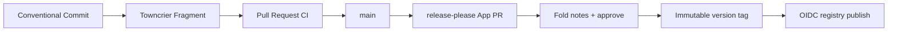

# Releasing in The Billy Company

This is the mental model, not a runbook for any one package. Every repository
here reaches its own registries; none of them ships from a laptop.

## The Two Release Planes

Two planes exist, and this document is about only one of them:

- **Plane 1 — public package release (this org).** Every independently
  versioned OSS package in this org — see the [live repository
  list](https://github.com/orgs/The-Billy-Company/repositories), never a
  snapshot of it kept here — publishes to its own registries under one shared
  lifecycle.
- **Plane 2 — Billy fleet delivery.** The private monorepo that hosts the
  product ships Cloud Run revisions under a gated staging → production
  promotion pipeline, with its own evidence and its own changelog tooling
  (chronicle, shipkit). That pipeline is out of scope here — see
  [billy's `CONTRIBUTING.md`](https://github.com/The-Billy-Company/billy/blob/main/CONTRIBUTING.md#14-delivery-billy-fleet-vs-oss-package-release)
  and ADR-195.

Nothing in this document applies to Plane 2, and nothing in the private
monorepo's delivery pipeline applies here — they don't share a tag, an App
installation, or a registry.

## The Package-Release Lifecycle

Seven steps carry a change from a commit to a published artifact:



Every step, spelled out:

1. **Conventional commit.** `feat:` / `fix:` / `perf:` / `refactor:` / `deps:`
   land in the changelog; `docs:` / `test:` / `build:` / `ci:` / `chore:` /
   `style:` stay hidden from it. The type is also what picks the next version
   — see [What Picks the Number](#what-picks-the-number).
2. **Towncrier fragment.** A one- or two-sentence news fragment
   (`changelog.d/+<slug>.<type>.md`) lands in the same PR as the change it
   describes. This is the release note a person reads — the conventional
   commit type only drives versioning.
3. **Pull request CI.** Every repo runs its own build matrix (a Zig engine +
   three bindings for the search family; `fmt` / `clippy` / `test` / `doc` /
   `msrv` / `deny` for the Rust-only repos) plus a stable, named
   `release-ready` aggregate check. That single check is what the release
   preflight below waits on — it never re-derives the matrix.
4. **`release-please` opens (or updates) a release PR.** It reads the commit
   history since the last tag, proposes the next semver, and rewrites every
   manifest carrying an `x-release-please-version` marker
   (`build.zig.zon`, `pyproject.toml`, `Cargo.toml`, …) in one commit — so a
   Zig package with no native version-bump tooling still moves every mirrored
   number atomically. It also folds the fragments accumulated in
   `changelog.d/` into `CHANGELOG.md` under the proposed version, and keeps
   that fold current as new fragments land while the PR is open.
5. **A human reads and approves.** The release PR is the one manual gate in
   the whole pipeline: someone reads the folded notes, corrects prose a
   machine wouldn't get right, and merges.
6. **Merging tags `vX.Y.Z`.** The tag is what every downstream job keys off —
   the version a wheel, crate, or Go module publishes under is read from the
   tag, never typed by hand a second time.
7. **The tag triggers the release pipeline**, staged
   `preflight → build every channel → publish channels → verify channels →
   finalize the release`, never publish-then-hope. The preflight and publish
   stages don't re-implement their checks per repository — every step below
   is one call into the shared `package-release` action
   (`.github/actions/package-release/`, used identically from every
   publishable repo's own `ci.yml` and `release.yml`), so a fix to a check or
   its rejection message is one change, not seven:
   - **Preflight** re-derives nothing; `ci-status` waits for and reads the
     `release-ready` check on the exact tagged commit, `tag-ancestor` confirms
     the tag is reachable from the protected default branch, `version`
     re-proves tag/manifest parity (every mirror carrying an
     `x-release-please-version` marker agrees, and agrees with the tag), and
     `changelog --require-fragments-empty` proves the fold actually happened
     — an exact `## [X.Y.Z]` heading, and nothing left un-folded in
     `changelog.d/` — all on the tagged tree, not on whatever the branch has
     since become.
   - **Build** produces every artifact for every channel (PyPI wheel/sdist,
     crates.io package, Go module tag, GitHub Release) before anything
     irreversible happens, and proves a floor install/import on each one.
   - **Publish** calls `registry-probe` before minting a credential: `absent`
     means publishable, `present` means a prior run already got there (a
     successful retry, not a failure), and `error` — the registry didn't
     answer — is never treated as `absent`, so a network blip can't
     masquerade as a green light. A version whose registry bytes would
     genuinely differ from what's on disk is a hard collision that fails the
     run. A partial external outage — PyPI up, crates.io down — resumes by
     publishing only the missing channels on retry.
   - **Verify** re-resolves what was just published from the public index
     (PyPI, the sparse crates.io index, the Go module proxy), not from the
     job's own build output.
   - **Finalize** flips the GitHub Release from draft to public and writes
     its body from the curated `CHANGELOG.md` section — never
     `generate_release_notes: true` — only after every declared channel
     verified.

Cross-registry publish is not atomic and never will be: PyPI and crates.io
have no shared transaction. The guarantee this pipeline makes instead is
narrower and honest — no write starts before every local and CI precondition
has passed, and any external partial failure is detected, immutable on the
tag, and safely resumable, rather than silently repeated or silently
abandoned.

## What Picks the Number

Plain semver over the commit types in the window since the last tag. Every
repository here uses release-please's stock `default` strategy, and no
repository puts a thumb on the scale:

| In the window since the last tag | Next version |
| --- | --- |
| any `!` suffix, or a `BREAKING CHANGE:` footer | major |
| any `feat` | minor |
| anything else — `fix`, `perf`, `refactor`, `deps`, `ci`, … | patch |

The largest change in the window wins; one `feat` among thirty `fix`es is a
minor. Read the corollary the other way too, because it surprises people: a
long unbroken run of minor releases is **not** the tooling refusing to cut a
patch. It means every window so far happened to carry a feature. A window that
genuinely holds no `feat` cuts a patch, with nothing to configure.

**Below 1.0.0 the table shifts one column left**, which is what
`bump-minor-pre-major` and `bump-patch-for-minor-pre-major` in a pre-1.0
repository's `release-please-config.json` are for: a breaking change takes the
minor rather than declaring 1.0.0 on your behalf, so `0.1.0` goes to `0.2.0`
for both a break and a feature, and to `0.1.1` for everything else.
release-please reads those two settings **only** while the version is below
1.0.0. They go inert the moment a package ships 1.0.0, and should be deleted
from the config in that same release — left behind, they read like a bump
policy that is no longer being consulted, which is worse than absent.

To pin a number the table would not pick — a version chosen to line up with a
downstream pin, or a patch on a minor nobody cut — put a `Release-As:` footer
in a commit body on the default branch:

```text
feat: name the package a listing governs, not the file it was written in

Release-As: 1.3.1
```

The newest such footer in the window wins and overrides everything above,
including a breaking change. It is the one place in this pipeline where a
human types a version, so type it deliberately: a release that skips a number
is a question every downstream reader has to answer once.

## Trusted Publishing

Every registry write authenticates with short-lived OIDC, minted per-run by
the registry itself — there is no `PYPI_API_TOKEN` or `CARGO_REGISTRY_TOKEN`
sitting in a repository secret to rotate or leak:

- **PyPI** — GitHub Actions OIDC exchanged for a scoped upload credential
  (`environment: pypi`, `permissions: id-token: write`), configured once per
  project as a PyPI Trusted Publisher naming this org, the repository, the
  `release.yml` workflow, and the `pypi` environment.
- **crates.io** — the same OIDC exchange (`environment: crates-io`), via
  `rust-lang/crates-io-auth-action`. A brand-new crate still needs one manual
  `cargo publish` with an API token before crates.io will accept a Trusted
  Publisher configuration — crates.io requires the crate to already exist.
- **Go modules** — no registry at all. The module proxy resolves a tagged
  commit directly from the repository; "publishing" is pushing the tag and
  then asking the proxy to ingest it.

An absent or misconfigured credential fails the publish job outright. None of
these pipelines have an optional-token branch that quietly no-ops when a
secret is missing — a channel either publishes or the run fails loudly on it.

## Independent Versions, Shared Substrate

`irregex` is the regex engine and the `libirgx` C-ABI floor; `gist`, `relate`,
and `blast` are three separate binaries built on top of it, each with its own
Python/Rust/Go bindings. They version independently — `gist` shipping a 1.4.0
says nothing about `relate`'s number — but they are not independent at build
time:

- **In CI and local development**, every face resolves `irregex` (and, for
  `blast`, `relate`) as a sibling checkout at its default branch —
  `build.zig.zon`'s Zig dependency, the Go `replace` directive, the `uv`
  path source, and the Rust path override all spell the same
  `../../../irregex/...` relative path. Nothing is patched for CI; the layout
  a contributor clones is the layout that builds.
- **In a published artifact**, that path resolves to a real version range
  read from the registry instead — `irregex>=1.0.0,<2` in `gist`'s and
  `relate`'s `pyproject.toml`, the equivalent `irgx = { version = "1.0.0" }`
  in each `Cargo.toml`. `blast` additionally depends on the published
  `gist-search` and `relate-search` ranges. So there is a real publish order
  — `irregex` → {`gist`, `relate`} → `blast` — and the release pipeline
  verifies it: a dependent face's floor-install check resolves against the
  registry, not a path, so it cannot race a dependency that hasn't landed
  yet.
- **The frozen baseline** — the version all four crossed together, once, is
  1.0.0, the release where the C ABI itself froze. They have diverged since;
  that starting line was never a promise to stay in lockstep.

## The Shared Package-Release Action

This document deliberately names no roster of packages — that list is
exactly the kind of fact that goes stale the day a new repository joins or an
existing one graduates a tier, and the [live repository
list](https://github.com/orgs/The-Billy-Company/repositories) is always ahead
of anything hand-maintained here. Read a repository's own tier from what it
actually carries, not from this page:

- **On the shared, fail-closed lifecycle** — it keeps a `release.toml`
  manifest at its root, a `release-please.yml` calling the
  `billy-company-release` App, and a `ci.yml`/`release.yml` that call the
  shared action below instead of hand-rolling their own version/changelog
  checks. That's the default for every active package in this org.
- **Pre-product, no release automation** — it ships no `release.yml` at all,
  and its own `CONTRIBUTING.md` says so plainly (a `0.0.0` version is usually
  the tell). Wiring release automation onto a package with nothing to
  version yet would document a promise the code doesn't keep. It graduates
  onto the shared lifecycle the day it ships something worth releasing —
  that's a change to its own repository, never to this page.

Every repository on the shared lifecycle calls the same composite action,
[`actions/package-release/`](actions/package-release/), rather than keeping
its own copy of these checks. It reads that package's `release.toml`
manifest — canonical version source and its kind (a Zig `build.zig.zon`
field, a Cargo workspace version, or a single crate's own), the mirrors that
must agree with it, the changelog fragment directory and quality bar, the
registries it publishes to, and the name of its `release-ready` aggregate
check — and exposes six commands (`version`, `changelog`, `ci-status`,
`tag-ancestor`, `registry-probe`, `selftest`), each emitting one consistent,
`::error::`-annotated rejection for the fault it's checking rather than a
different error shape per repository. `selftest` runs offline, with no
network and no token, and proves the other five commands actually reject the
fixtures they claim to reject — the thing to run after touching any of the
five modules behind them. A change to the lifecycle itself — a new rejection
class, a new registry, a new verification step — is a change to that one
action, not to seven copies of a workflow. Small, already-real drift that
isn't worth silently calling "standard" lives in
[`docs/alignment-backlog.md`](docs/alignment-backlog.md) instead of being
glossed over here.

## The App Identity Behind the Release PR

`release-please` runs as the `billy-company-release` GitHub App, not as
Actions, because `GITHUB_TOKEN` cannot do what this step needs twice over:
the enterprise blocks the Actions identity from opening pull requests at all,
and even if it could, a tag pushed by that identity would never trigger the
workflow that publishes from that tag (GitHub's own recursive-workflow
guard). An installation token is a different actor and clears both walls at
once.

Its identifier lives as the org variable `RELEASE_APP_CLIENT_ID`, its
signing key as the org secret `RELEASE_APP_PRIVATE_KEY` — one pair, shared
by every repository in this ecosystem so there is exactly one thing to ever
rotate — and every token it mints is narrowed to the handful of permissions
the step in hand actually uses and expires within the hour. Its installation
is scoped to this ecosystem's public repositories; a token minted from it
structurally cannot reach the private monorepo.

Full audit, owner-side facts source code can't answer, and the
build-vs-reuse decision for anything further:
[`docs/github-apps.md`](docs/github-apps.md).

## Where the Rest of the Detail Lives

This document is the map, not the territory. Each repository keeps its own
`CONTRIBUTING.md` for what's genuinely local — wheel matrices, oracle
regeneration, its own contracts, the exact commands for its own release — and
links back here for the shared model rather than repeating it. Open that
repository's `CONTRIBUTING.md` directly; this page doesn't keep its own copy
of that link either.
